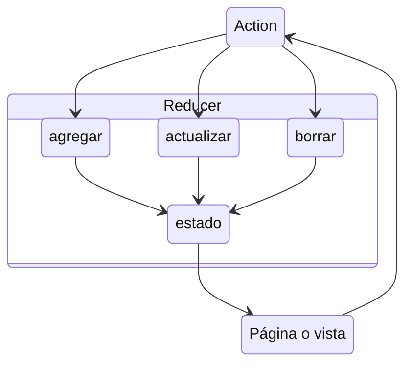

# Sección 1: Introducción al curso

[React: De cero a experto ( Hooks y MERN )](https://www.udemy.com/course/react-cero-experto)

## Instalaciones necesarias
- VS Code
- React Developer Tools
- Redux Devtools
- Postman
- MongoDB Compass
- Git
- Node

# Sección 2: Introducción a React y conceptos generales
**Conceptos a aprender en esta sección:**
- ¿Que es React?
- Conceptos generales
- Babel
- JSX

## React
Es una **librería** que permite crear aplicaciones. Esta hecho para trabajar con aplicaciones de todo tipo de magnitud, ya sea aplicaciones sencillas, intermedias o robustas con alto nivel de interactividad. Al ser _declarativa_ es fácil seguir patrones de diseño. Muy _eficiente_. React trabaja de manera _predecible_. Trabaja con componentes que son pequeñas piezas de código y simple y sencillo.
Otras caracteristicas interesantes de React son que nos permite trabajar con server-side rendering con Node y que también se puede trabajar en aplicaciones móviles con React Native.
```javascript
const divRoot = document.querySelector('#root');

const h1Tag = <h1>Hola mundo</h1>

ReactDOM.render( h1Tag, divRoot );
```

# Sección 3: Introducción a JavaScript moderno
**Puntos clave de la sección:**
- Generar la base sobre Javascript
- Constantes y variables let
- Template string
- Objetos literales
- Arreglos
- Desestructuración de objetos
- Promesas
- Fetch API
- Ternarios
- Async - Await

# Sección 4: Primeros pasos en React
**Puntos clave de la sección:**
- Nuestra primera aplicación - Hola Mundo
- Exposiciones sobre los componentes
- Creación de componentes (Functional Componentes)
- Propiedades - Props
- Impresiones en el HTML
- PropTypes
- DefaultProps
- Introducción general a los Hooks
- useState

## Componente
Cuando hablamos de componente nos referimos a un bloque de código aislado que puede tener estado o no. Un componente puede contener múltiples componentes dentro llamados componentes hijos. Esto convierte al DOM en un árbol de componentes.
Cuando nos referimos a que el componente puede tener un estado nos referimos a la información del componente en un tiempo especifico.

## Vite vs create-react-app
Create React App permite crear un proyecto base de React usando webpack con una configuración ya realizada con jest y otras librerías. Vite utiliza otra forma para hacer los cambios de módulos que es mas rápido que webpack. Para proyectos grandes vite ofrece una experiencia mas amigable.

# Sección 5: Pruebas unitarias y de integración
**Puntos clave de la sección:**
- Introducción a las pruebas
- AAA
  - Arrange - Arreglar
  - Act - Actuar
  - Assert - Afirmar
- Primeras pruebas
- Jest
- Expect
- toBe
- Enzyme
- Comandos útiles en la terminal para pruebas
- Revisar elementos renderizados en el componente
- Simular eventos

Esta sección de pruebas es sumamente importante porque nos dará la base de las pruebas que estaremos haciendo durante el curso, las pruebas irán creciendo en complejidad, por lo que les recomiendo que nos aseguremos de comprender bien todos estos conceptos para que nos sea más fácil las siguientes secciones de pruebas.

# Sección 6: GifExpertApp
**Puntos clave de la sección:**
- Custom Hooks
- Fetch hacia un AP
- Comunicación entre componentes
- Clases de CSS
- Animaciones
- Enviar métodos como argumentos
- Crear listados
- keys
- Giphy

Esta es una aplicación pequeña pero muy ilustrativa que explica cómo utilizar React + CustomHooks para poder ersolver necesidades en específico que podremos reutilizar después.

# Sección 7: Generando el build de producción y despliegues
**Puntos clave de la sección:**
- Aprender cómo realizar backups a repositorios de Git
- Subir nuestro repositorio a GitHub
- Uso de Github Pages
- Desplegar nuestra aplicación de React
- Generar build de producción de nuestra aplicación

Aunque es una sección pequeña, les puede servir para desplegar infinidad de proyectos de React de forma gratuita, sin contar que tendrán respaldos de sus proyectos por si llegan a perder su trabajo que tenían localmente en su computadora.

# Sección 8: Testing - Probando la aplicación de GifExpert
**Puntos clave de la sección:**
- Seguir el camino de las pruebas
- Pruebas en componentes específicos
- Pruebas en componentes de forma individual
- Pruebas con customHooks
- Esperar cambios en un customHook
- Simular eventos en inputs y formularios
- Simular llamadas a funciones
- Evaluar si existen elementos en el componente

En esta sección seguiremos expandiendo todo lo que habíamos visto anteriormente en otras secciones de pruebas, pero ahora veremos más a detalle los temas y adicionalmente introduciremos nuevos conceptos y nuevos tipos de pruebas. Para orientarnos en la instalación de Jest y React testing library en el proyecto podemos usar [esta guia](https://gist.github.com/Klerith/ca7e57fae3c9ab92ad08baadc6c26177).

# Sección 9: Profundizando Hooks - Generales
**Puntos clave de la sección:**
- Profundizar en el tema de los Hooks
- Crear otros customHooks
- useState
- useCounter - Personalizado
- useEffect y sus precauciones
- useRef
- useFetch - Personalizado + optimizaciones
- useLayoutEffect
- Memo
- useMemo
- useCallback

Estos son los Hooks relativamente simples, aún hay mas que explicaremos más adelante, pero en esta sección nos enfocaremos en estos trabajos y para qué nos pueden servir.
Adicionalmente estaremos dejando las bases para lo que será una sección de pruebas sumamente interesantes despues.

# Sección 10: Profundizando Hooks - useReducer
**Puntos clave de la sección:**
- useReducer
- Reducers
- Teoría de un reducer
- Aplicación de TODOs
- CRUD local

Esta es una sección dedicada a comprender el concepto de un Reducer, el cual es sumamente importante para poder entrar a Redux o bien usar el contextAPI fácilmente

## Que es un Reducer
- Función común y corriente
- Debe de ser una función pura
  - No debe de tener efectos secundarios
  - No debe de realizar tareas asíncronas
  - Debe de retornar siempre un estado nuevo
  - No debe de llamar localStorage o sessionStorage
  - No debe de requerir más que una acción que puede tener un argumento
- Debe de retornar un nuevo estado
- Usualmente sólo recibe dos argumentos
  - El valor inicial (initalState) y la acción a ejecutar

## Funcionamiento



# Sección 11: Profundizando Hooks - useContext
**Puntos clave de la sección:**
- Context
- Provider
- useContext
- React Router
- Links y NavLinks
- CreateContext
- SPA ( Single Page Application )

El objetivo de la sección es pricipalmente aprender sobre el Context, el Router es un valor agregado que explotaremos mucho más en las próximas secciones, pero al usar un Router, podemos explicar claramente el problema y necesidad del context.

# Sección 12: Pruebas unitarias y de integración - Hooks

# Sección 13: Bonus: Repositorio de Custom Hooks

# Sección 14: HeroesApp - Single Page Application (SPA)
**Puntos clave de la sección:**
- SPA ( Single Page Application ) a profundidad
- Diferentes temas en la misma aplicación aplicados a diferentes rutas
- Multiples Routers
- Push y Replace en el History
- Leer argumentos por URL
- QueryParams
- Aplicar filtros utilizando QueryStrings

En esta sección aún no haremos protección de rutas, pero dejaremos el estilo de esos componentes listos para la siguiente sección.

Aqui nos enfocaremos en la funcionalidad de la aplicación suponiendo que esatmos autenticados.

# Sección 15: Protección de Rutas
**Puntos clave de la sección:**
- Rutas públicas
- Rutas privadas
- Login y logout - Sin backend aún
- Recordar cuál fue la última ruta visitada para mejorar la experiencia de usuario.
- Context
- Reducer

Esta es una sección pequeña pero importante para trabajar las bases de la autenticación y protección de nuestra aplicación.